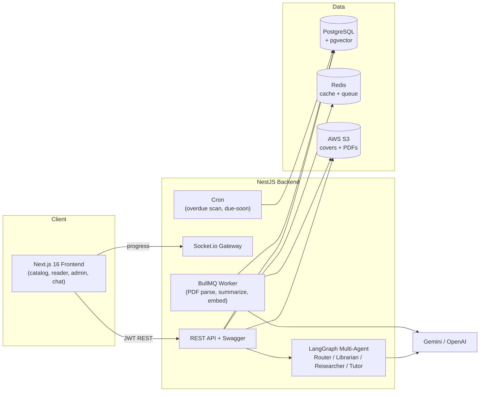
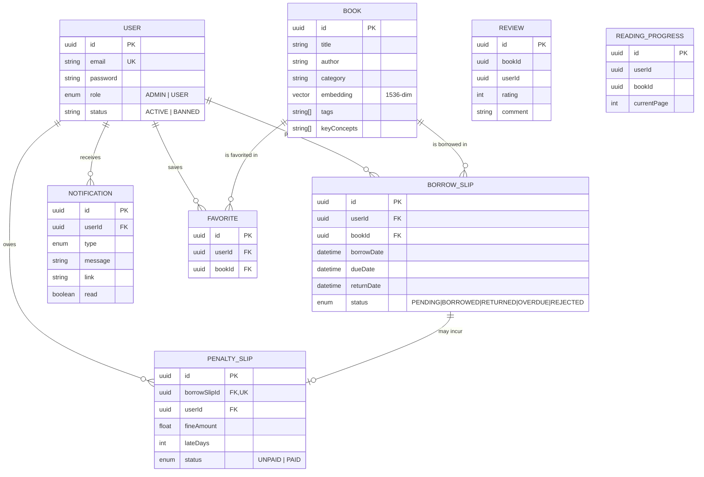

# 📚 Digital Library — AI-Powered Digital Library System

A full-stack digital library platform where users discover, borrow (request timed reading access), and read PDF publications, enhanced with an AI multi-agent assistant, semantic (vector) search, personalized recommendations, and a complete admin console.

> Graduation project. Backend: **NestJS** · Frontend: **Next.js 16** · DB: **PostgreSQL + pgvector** · Cache/Queue: **Redis + BullMQ** · Storage: **AWS S3** · AI: **Gemini / OpenAI + LangGraph**.

---

## ✨ Features

### For readers
- 🔎 **Catalog** with text search, category filters, **sorting** and **pagination**
- 🧠 **AI semantic search** (cosine similarity over 1536-dim embeddings)
- 📖 **Secure PDF reader** with real-time reading-progress sync (Socket.io)
- 🤝 **Borrow workflow** — request → librarian approval → 14-day reading window → return
- ⚠️ **Penalties** for late returns ($1/day), with borrowing blocked until settled
- ❤️ **Favorites / wishlist**
- ▶️ **Continue reading** (resume from your last page)
- ✨ **Personalized recommendations** (vector similarity on your borrow history)
- 🔔 **Notifications** (borrow approved/rejected, due-soon, overdue, penalty issued)
- 💬 **Floating AI assistant** (multi-agent: Router → Librarian / Researcher)
- 🎓 **AI Tutor** — explains highlighted passages while reading
- 👤 **Profile** page with activity stats + password change

### For admins
- 📊 **Dashboard** with real statistics + charts (borrow trends, category split, top books)
- 📕 **Book management** (CRUD + S3 cover/PDF upload, AI summary/tags auto-generated)
- 👥 **User management** (roles, ban/unban)
- 📋 **Borrow requests** queue (approve / reject / mark returned)
- 💵 **Penalty management** (mark paid, totals)

---

## 🧱 Tech Stack

| Layer | Technology |
|---|---|
| Backend | NestJS 11, TypeScript, Prisma 7 |
| Frontend | Next.js 16 (App Router), React, TailwindCSS, lucide-react |
| Database | PostgreSQL 16 + `pgvector` |
| Cache / Queue | Redis 7, BullMQ |
| Storage | AWS S3 (covers + PDFs) |
| AI | Google Gemini / OpenAI (embeddings + chat), LangChain + LangGraph |
| Realtime | Socket.io |
| Auth | JWT + Passport, RBAC (ADMIN/USER) |
| Security | Rate limiting (`@nestjs/throttler`), env-based CORS, global exception filter |

---

## 🏗️ Architecture



### Entity Relationship Diagram



---

## 🚀 Getting Started

### Prerequisites
- Node.js 20+
- Docker + Docker Compose (for PostgreSQL & Redis)
- An AWS S3 bucket (for file storage) and a Gemini **or** OpenAI API key (for AI features)

### Option A — Local development

```bash
# 1. Clone & install backend deps
npm install

# 2. Configure environment
cp .env.example .env          # then edit values (DB, JWT, AWS, AI key)

# 3. Start PostgreSQL + Redis
docker compose up -d db redis

# 4. Sync database schema
npx prisma db push

# 5. Seed an admin + demo data (optional)
npm run seed

# 6. Run the backend (http://localhost:3002, Swagger at /api)
npm run start:dev
```

```bash
# 7. Frontend (separate terminal)
cd frontend
npm install
cp .env.example .env.local    # adjust NEXT_PUBLIC_API_URL if needed
npm run dev                    # http://localhost:3000
```

### Option B — Full Docker stack

```bash
cp .env.example .env          # fill in AWS + AI credentials
docker compose up --build     # db, redis, backend (:3002), frontend (:3000)
```

> The backend container runs `prisma db push` automatically on start. Run `docker compose exec backend npm run seed` once to seed demo data.

### Default demo accounts (after `npm run seed`)

| Role | Email | Password |
|---|---|---|
| Admin | `admin@lib.com` | `admin1234` |
| User | `user@lib.com` | `user1234` |

---

## 🔐 Environment Variables

See [`.env.example`](./.env.example) for the full list. Key entries:

| Variable | Description |
|---|---|
| `DATABASE_URL` | PostgreSQL connection string |
| `JWT_SECRET` / `JWT_EXPIRES_IN` | Auth token config |
| `CORS_ORIGINS` | Comma-separated allowed frontend origins (empty = allow all in dev) |
| `THROTTLE_TTL` / `THROTTLE_LIMIT` | Rate-limit window (s) and max requests |
| `AWS_*` | S3 credentials + bucket |
| `REDIS_HOST` / `REDIS_PORT` | Redis connection |
| `GEMINI_API_KEY` *or* `OPENAI_API_KEY` | AI provider key |

> ⚠️ Never commit `.env`. It is git-ignored. Rotate any credentials that were ever shared.

---

## 🧪 Testing

```bash
npm test            # unit tests (auth, borrow/penalty logic)
npm run test:cov    # with coverage
```

---

## 📂 Project Structure

```
digital-library/
├── src/
│   ├── auth/            # JWT auth, login/register, change-password, profile
│   ├── users/           # user CRUD + roles + ban
│   ├── books/           # catalog, search, reader progress, reviews, recommendations
│   ├── borrow-slips/    # borrow workflow + penalties + cron
│   ├── notifications/   # in-app notifications
│   ├── favorites/       # wishlist
│   ├── ai/              # embeddings + provider client
│   ├── agent/           # LangGraph multi-agent assistant + tutor
│   ├── stats/           # admin dashboard analytics
│   ├── s3/              # AWS S3 helpers
│   ├── common/filters/  # global exception filter
│   └── prisma/          # Prisma service
├── prisma/
│   ├── schema.prisma
│   └── seed.ts
├── frontend/            # Next.js 16 app
├── Dockerfile           # backend image
├── docker-compose.yml   # db + redis + backend + frontend
└── .env.example
```

---

## 📡 API Overview

Full interactive docs at **`http://localhost:3002/api`** (Swagger). Highlights:

| Area | Endpoints |
|---|---|
| Auth | `POST /auth/register`, `POST /auth/login`, `GET /auth/me`, `PATCH /auth/change-password` |
| Books | `GET /books` (search/sort/paginate), `GET /books/semantic-search`, `GET /books/recommendations`, `GET /books/reading/history` |
| Borrowing | `POST /borrow-slips`, `GET /borrow-slips/my`, `PATCH /borrow-slips/:id/approve|reject|return` |
| Penalties | `GET /borrow-slips/penalties`, `PATCH /borrow-slips/penalties/:id/pay` |
| Favorites | `GET /favorites`, `POST|DELETE /favorites/:bookId` |
| Notifications | `GET /notifications`, `GET /notifications/unread-count`, `PATCH /notifications/read-all` |
| AI | `POST /ai/chat`, `POST /ai/tutor` |
| Admin | `GET /admin/stats`, `GET /users`, `GET /borrow-slips` |

---

## 📝 Notes
- Digital books are always readable online; "borrowing" models a timed reading-access request with librarian approval and late-return penalties (no physical stock).
- AI features degrade gracefully: if the provider rate-limits or a key is missing, the chat/tutor return a friendly message instead of failing.
